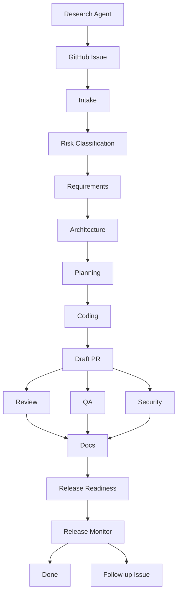

# AgentWorkflowPDLC

AgentWorkflowPDLC is a GitHub Issue based PDLC workflow for coordinating AI agents with manual human approval gates.

The current version is intentionally lightweight but now supports an automated issue to PR loop:

- GitHub Issue is the source of work.
- Each PDLC stage is represented by a checklist item in the issue body.
- GitHub Actions reads the checklist and comments the current workflow status.
- The analysis agent comments a proposed split for new PDLC issues.
- Humans approve analysis by commenting `/approve analysis`.
- The coding agent creates a branch, generated artifacts, and a PR.
- Pull requests link back to the issue and must include generated artifacts.
- The release monitor runs after merge and can create follow-up issues.

## Workflow



## Manual Approval Model

Manual approval is done in two ways:

- checklist approvals still document stage acceptance,
- `/approve analysis` starts the coding agent and PR creation.

The current agent workers do not run LLMs and do not call external tools. They are deterministic scripts used to prove the GitHub automation contract before replacing them with Copilot, an LLM API, or MCP-backed workers.

## Repository Structure

```text
.github/
  ISSUE_TEMPLATE/
    pdlc-task.yml
    config.yml
  scripts/
    pdlc-agent-analyze.mjs
    pdlc-agent-code.mjs
    pdlc-issue-checklist.mjs
    pdlc-release-monitor.mjs
    pdlc-research-agent.mjs
  workflows/
    pdlc-agent-analysis.yml
    pdlc-agent-coding.yml
    pdlc-issue-checklist.yml
    pdlc-release-monitor.yml
    pdlc-research-agent.yml
  pull_request_template.md
docs/
  automated-agent-loop.md
  agentic-pdlc-workflow.md
  github-issue-approval-workflow.md
```

## Start

1. Create a new issue using the `PDLC Agent Task` template.
2. Fill business input in Polish.
3. Wait for the analysis agent comment.
4. Comment `/approve analysis` after human review.
5. Review the PR created by the coding agent.
6. Merge the PR after CI and human approval.
7. Check the release monitoring comment or follow-up issue.

See `docs/automated-agent-loop.md` for the automated flow details.

