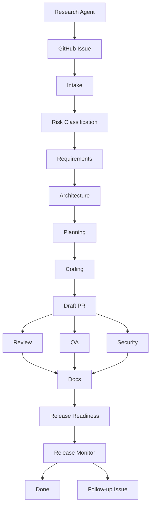

# AgentWorkflowPDLC

AgentWorkflowPDLC is a GitHub Issue based PDLC workflow for coordinating AI agents with manual human approval gates.

The current version is intentionally lightweight but now supports an automated issue to PR loop:

- GitHub Issue is the source of work.
- Each PDLC stage is represented by a checklist item in the issue body.
- `PDLC Agent Router` reads GitHub events and decides which agent job should run.
- A stage agent stops and asks questions in issue comments when required input is missing.
- Users answer with `/pdlc answer` and the same stage continues from PR context.
- Humans can use `/approve ai-coding` to run the local Claude Code worker on a self-hosted Windows runner.
- Humans can use `/fix-review` on a PR to run the local Claude Code review-fix worker.
- Claude Code workers fetch specialist agent prompts from `AgentWorkflowPDLC-AgentConfig` at startup.
- Humans can drive separate PDLC stages with `/pdlc research`, `/pdlc analyze`, `/pdlc risk`, `/pdlc architecture`, and `/pdlc plan`.
- A new issue first runs autonomy risk assessment and receives one of three labels: `pdlc-mode:developer`, `pdlc-mode:semi-auto`, or `pdlc-mode:full-auto`.
- Stage agents maintain one long-lived PR per issue and write spec artifacts into `pdlc-runs/issue-<number>/`.
- A user commit can trigger a stage with commit text like `[PDLC #16] /pdlc analyze`.
- Pull requests link back to the issue and must include generated artifacts.

## Workflow



## Manual Approval Model

Manual approval is done in two ways:

- checklist approvals still document stage acceptance,
- `/approve ai-coding` starts local AI implementation on the long-lived PR.

The command-driven stage agents, local coding worker, and review-fix worker use Claude Code on the self-hosted Windows runner.

## Repository Structure

```text
.github/
  ISSUE_TEMPLATE/
    pdlc-task.yml
    config.yml
  scripts/
    pdlc-agent-router.mjs
    pdlc-local-claude-stage-worker.ps1
    pdlc-local-claude-worker.ps1
    pdlc-local-claude-review-fix-worker.ps1
  workflows/
    pdlc-agent-router.yml
  pull_request_template.md
docs/
  automated-agent-loop.md
  agentic-pdlc-workflow.md
  github-issue-approval-workflow.md
  local-claude-code-worker.md
  local-claude-review-fix-worker.md
  external-agent-config-repository.md
  pdlc-agent-router.md
  pdlc-command-driven-stage-agents.md
  pdlc-spec-artifacts-in-pr.md
  pr-workflow-test-scenario.md
```

## Start

1. Create a new issue using the `PDLC Agent Task` template.
2. Fill business input in Polish.
3. Wait for the autonomy risk label and the long-lived PDLC PR.
4. Drive the staged flow with `/pdlc research`, `/pdlc analyze`, `/pdlc risk`, `/pdlc architecture`, and `/pdlc plan`, or let `pdlc-mode:full-auto` continue automatically.
5. If an agent asks questions, answer with `/pdlc answer` and `stage: <stage>`.
6. Comment `/approve ai-coding` for the local Claude Code worker.
7. Review the PR created by the PDLC agents.
8. Comment `/fix-review` on the PR when review feedback should be addressed by the local Claude Code worker.
9. Merge the PR after human approval.

See `docs/automated-agent-loop.md` for the automated flow details.
See `docs/local-claude-code-worker.md` for the self-hosted Claude Code worker.
See `docs/local-claude-review-fix-worker.md` for review feedback fixes.
See `docs/external-agent-config-repository.md` for fetched agent configuration.
See `docs/pdlc-agent-router.md` for centralized GitHub event routing.
See `docs/pdlc-command-driven-stage-agents.md` for staged GitHub issue commands.
See `docs/pdlc-spec-artifacts-in-pr.md` for PR-visible spec artifacts.

