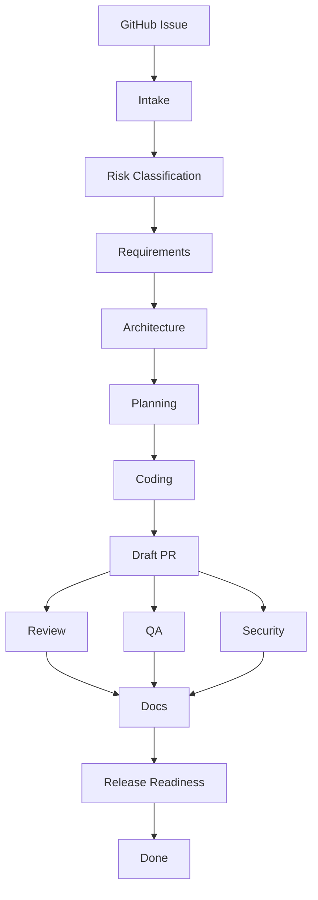

# AgentWorkflowPDLC

AgentWorkflowPDLC is a GitHub Issue based PDLC workflow for coordinating AI agents with manual human approval gates.

The current version is intentionally lightweight:

- GitHub Issue is the source of work.
- Each PDLC stage is represented by a checklist item in the issue body.
- GitHub Actions reads the checklist and comments the current workflow status.
- Humans manually approve each stage by checking the relevant box in the issue.
- Agents may prepare artifacts, but humans decide when the workflow advances.
- Pull requests link back to the issue and must include the generated artifacts.

## Workflow



## Manual Approval Model

Manual approval is done by editing the issue checklist. A checked stage means that a human has reviewed the artifact for that stage and accepts moving forward.

The action does not run LLMs and does not call external tools. It only validates issue state and posts a status comment.

## Repository Structure

```text
.github/
  ISSUE_TEMPLATE/
    pdlc-task.yml
    config.yml
  scripts/
    pdlc-issue-checklist.mjs
  workflows/
    pdlc-issue-checklist.yml
  pull_request_template.md
docs/
  agentic-pdlc-workflow.md
  github-issue-approval-workflow.md
```

## Start

1. Create a new issue using the `PDLC Agent Task` template.
2. Fill business input in Polish.
3. Let agents or humans produce artifacts for the first stage.
4. Check the stage checkbox after human review.
5. GitHub Actions will comment the current status and next required stage.
6. Continue until release readiness is approved.

