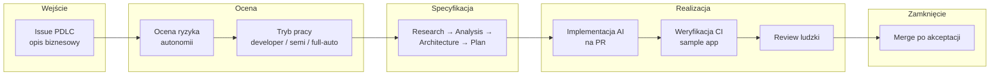
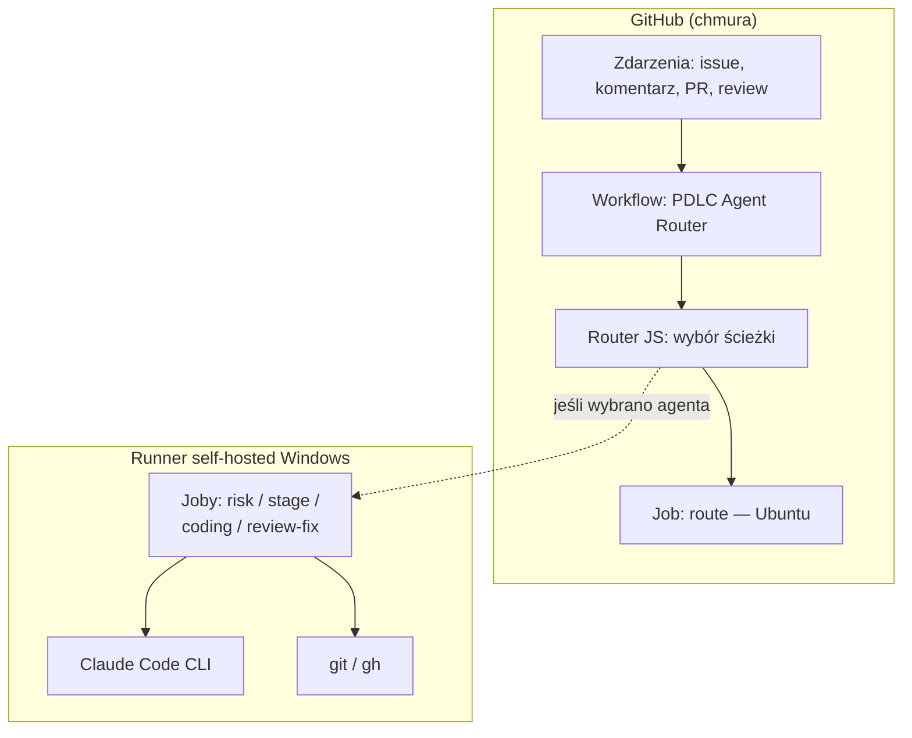
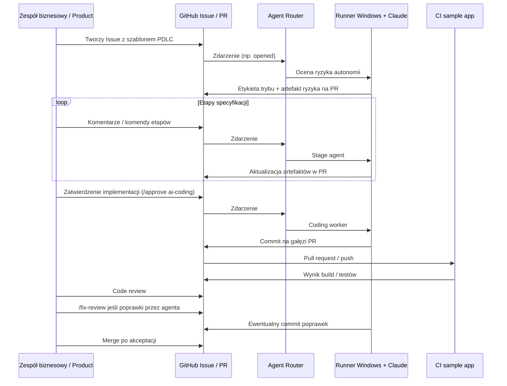
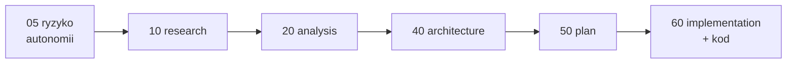
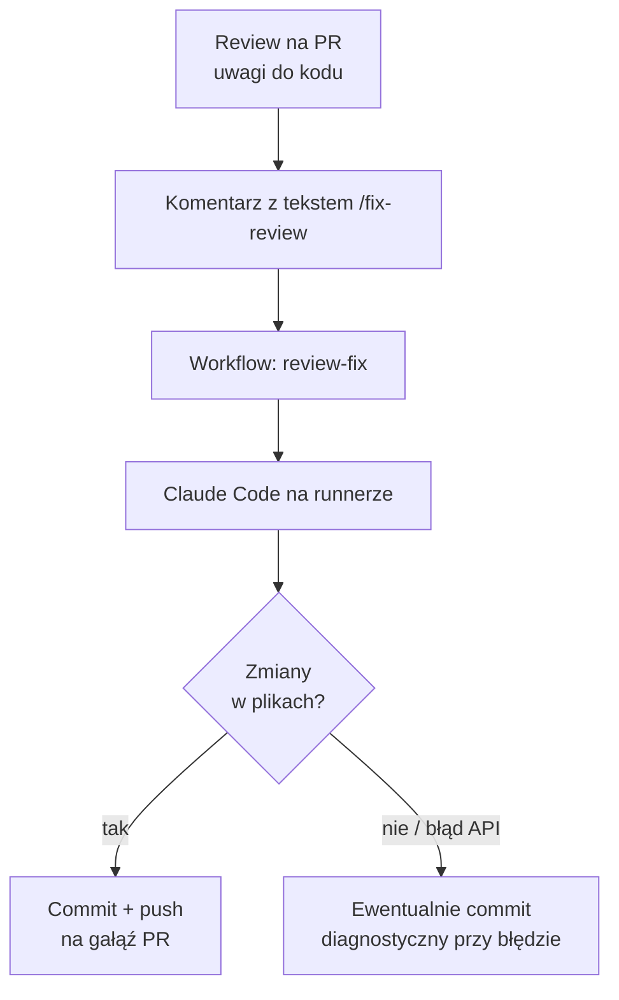
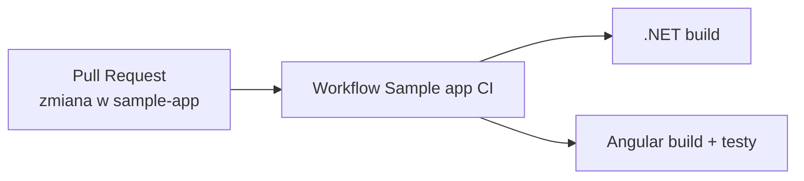

# PDLC w AgentWorkflowPDLC — przegląd procesu dla zarządu

Dokument ma charakter **prezentacyjny**: pokazuje *jak* GitHub Issue prowadzi pracę agentów AI i ludzi, *gdzie* są bramki akceptacji oraz *co* jest zautomatyzowane na runnerze firmowym (Windows). Szczegóły techniczne są w pozostałych plikach w `docs/`.

---

## 1. Cel biznesowy (jednym akapitem)

**PDLC** (Product Development Life Cycle w tej implementacji) wiąże **jedno zgłoszenie biznesowe** (GitHub Issue) z **jednym długotrwałym Pull Requestem**, w którym zbierane są **artefakty** (research, analiza, architektura, plan, implementacja). Agenty AI przygotowują materiały i kod na **zatwierdzenie człowieka**; sam serwer CI na GitHubie **steruje tylko routingiem zdarzeń**, a **ciężkie wywołania modelu** uruchamiane są **lokalnie na powołanym runnerze** — zgodnie z polityką dostępu do modeli i repozytoriów.

---

## 2. Widok ogólny: od pomysłu do merge

**Komunikat dla zarządu:** praca jest **śledzalna w jednym PR**, a kolejność etapów i zatwierdzenia są **widoczne w historii GitHub**, nie w mailach.

---

## 3. Architektura sterowania: GitHub Actions + runner self-hosted

**Dlaczego tak:** router działa **szybko i tanio** na Ubuntu; **wykonanie agenta** jest na maszynie z oznaczeniem `pdlc-worker`, gdzie są narzędzia i polityka dostępu do **Claude Code** oraz do **repozytorium kodu**.

---

## 4. Sekwencja typowego przebiegu (uproszczona)

---

## 5. Etapy artefaktów na Pull Requeście

Pliki żyją w katalogu `pdlc-runs/issue-<numer>/` na gałęzi PR — to **jedno źródło prawdy** dla przebiegu PDLC dla danego zgłoszenia.

---

## 6. Tryby autonomii (etykiety)

| Tryb | Znaczenie dla organizacji |
|------|---------------------------|
| **Developer** | Główna implementacja po stronie **developera** — agent wspiera dokumentację i analizę. |
| **Semi-auto** | Kolejne etapy po **świadomych komendach** zespołu w Issue. |
| **Full-auto** | Po każdym udanym etapie możliwe **automatyczne zlecenie kolejnego** (wg konfiguracji). |

Decyzja startuje od **oceny ryzyka** pierwszego uruchomienia.

---

## 7. Ścieżka „popraw po review” (`/fix-review`)

**Uwaga prezentacyjna:** jeśli model nie zmieni plików aplikacji (limit konta, brak edycji), na PR mogą trafić wyłącznie **logi i artefakty diagnostyczne** — to nie zastępuje poprawki funkcjonalnej; wymaga ponowienia po dostępności modelu lub ręcznej poprawki.

---

## 8. CI aplikacji przykładowej (sample app)

Oddzielny workflow uruchamia się przy zmianach w `sample-app/dotnet-api` lub `sample-app/angular-frontend` — **nie zastępuje** procesu PDLC, tylko **weryfikuje jakość kodu** w repozytorium szkoleniowym.

---

## 9. Podział odpowiedzialności (do slajdu „kto co robi”)

| Element | Kto |
|--------|-----|
| Treść zadania, akceptacja biznesowa | Product / właściciel Issue |
| Merge PR, zgodność z procedurą | Maintainer / tech lead |
| Uruchomienie agentów (komendy, etykiety) | Zespół wg instrukcji w README |
| Wykonanie Claude Code | **Runner self-hosted** (konfiguracja stacji) |
| Konfiguracja promptów zewnętrznych | Repozytorium AgentConfig (osobne) |
| Limity i koszty modelu | Umowa / konsola Anthropic, zmienne w repo |

---

## 10. Ryzyka i otwarte obszary (transparentnie dla zarządu)

- **Zależność od dostępności modelu** (quota, billing) — wpływa na to, czy commit z kodem powstanie w jednym przebiegu.
- **Runner self-hosted** — wymaga utrzymania maszyny i aktualnego Claude Code.
- **Repo szkoleniowe** — sample app służy walidacji procesu; mapowanie na produkcję wymaga osobnej decyzji architektonicznej.

---

## 11. Odniesienia do dokumentacji szczegółowej

| Temat | Plik |
|-------|------|
| Router zdarzeń | `docs/pdlc-agent-router.md` |
| Etapy `/pdlc …` | `docs/pdlc-command-driven-stage-agents.md` |
| Worker implementacji | `docs/local-claude-code-worker.md` |
| Worker review-fix | `docs/local-claude-review-fix-worker.md` |
| Konfiguracja agentów zewnętrznych | `docs/external-agent-config-repository.md` |
| CI sample app + diagnostyka Claude | `docs/sample-app-pr-ci.md`, `docs/pdlc-claude-diagnostics.md` |

---

*Dokument można eksportować do PDF (np. z podglądu Markdown w IDE lub narzędzia firmowego) albo przenieść diagramy Mermaid do PowerPoint przez eksport obrazów z rendererów Mermaid.*

